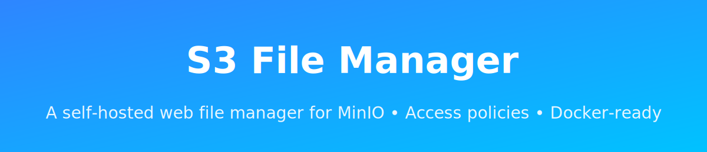

<p align="center">
  
</p>

<h1 align="center">S3 File Manager</h1>

<p align="center">
A modern, self-hosted web file manager for S3/MinIO — extensible backends, flexible access policies, and fully Docker-ready.
</p>

<p align="center">
    <a href="#features">Features</a> •
    <a href="#current-status">Current Status</a> •
    <a href="#quickstart">Quickstart</a> •
    <a href="#configuration">Configuration</a> •
    <a href="#architecture">Architecture</a> •
    <a href="#roadmap">Roadmap</a> •
    <a href="#license">License</a>
</p>

---

## 📌 Overview

**S3 File Manager** is a self-hosted, extensible web application that delivers a modern file-explorer experience on top of any **S3-compatible object storage**, starting with native support for **MinIO**.

**Tech stack**
- .NET 10 / ASP.NET Core (C#)
- Blazor Server-based web UI
- Syncfusion Blazor File Manager as the primary UI component library
- S3-compatible backends (MinIO first)

It is designed with strong architectural boundaries:

- 🔌 **Pluggable storage backends** (`IObjectStorageBackend`)
- 🔐 **Customizable access policies** (`IAccessPolicyProvider`)
- 🧾 **Pluggable audit logging** (`IAuditLogProvider`)
- 🐳 **Fully Docker-ready**

While MinIO is the first supported backend, the architecture is cloud-agnostic and intentionally built to support multiple object-storage providers in the future.

---

## 🟢 Current Status

### **Supported Now**
- ✔️ MinIO / S3-compatible storage  
- ✔️ Docker deployment  
- ✔️ File operations (browse, upload, download, rename, delete, move)  
- ✔️ Path-based access policies  
- ✔️ Pluggable policy provider (`IAccessPolicyProvider`)  
- ✔️ Pluggable storage backend interface  
- ✔️ Basic authentication modes (OIDC/local)

### **Planned**
- ⏳ Azure Blob Storage backend  
- ⏳ AWS S3 / Ceph RGW / Wasabi / Backblaze B2 backends  
- ⏳ Multiple virtual roots  
- ⏳ File previews and thumbnails  
- ⏳ Link sharing (pre-signed URLs)  
- ⏳ Admin configuration dashboard  
- ⏳ Kubernetes Helm chart  
- ⏳ Localization  
- ⏳ Advanced audit log providers (DB, MQ, webhooks)

---

## ✨ Features

### Core
- 🗂 Modern web file manager UI  
- 📁 Browse, upload, download, rename, delete, move  
- 🔍 Search, sort, and right-click context menu  

### Storage Backends
- 🟦 Built-in MinIO backend  
- 🔌 Custom backends via `IObjectStorageBackend`  
- 🌐 Designed for future Azure Blob / AWS S3 support

### Access Control
- 🔑 Path-based permissions  
- 👥 User & role mapping  
- 🧩 Policy engine with `IAccessPolicyProvider`

### Authentication
- 🧱 OIDC/SSO integration (Keycloak, Auth0, Azure AD, Okta, etc.)  
- 🔐 Local username/password mode (optional)  
- 👁 Public read-only mode (optional)

### Extensibility
- 🧱 Storage backend abstraction  
- 🧾 Custom audit log providers (`IAuditLogProvider`)  
- 📂 Configurable root mapping / virtual folder structure  

### UI & Components
- UI built on Syncfusion Blazor File Manager for a Windows-Explorer-like experience (toolbar, navigation pane, context menu, drag-and-drop, upload/download, rename, move, delete, etc.)
- The Syncfusion File Manager is wired to the backend `IObjectStorageBackend` so it can operate against MinIO / other S3-compatible storage.

### Deployment
- 🐳 Official Docker image  
- 🔧 Environment variable configuration  
- ☸️ Kubernetes support (planned)

---

## 🚀 Quickstart

### Run with Docker (MinIO backend)

```bash
docker run -d \
  -p 8080:8080 \
  -e STORAGE__BACKEND=Minio \
  -e MINIO__ENDPOINT=http://minio:9000 \
  -e MINIO__ACCESSKEY=minioadmin \
  -e MINIO__SECRETKEY=minioadmin \
  -e MINIO__BUCKET=ftp \
  farshaddavoudi/s3-filemanager:latest
```

Open:

```text
http://localhost:8080
```

---

## ⚙️ Configuration

All settings can be controlled via:

- `appsettings.json`
- Environment variables
- Docker secrets (recommended)

Example:

```bash
STORAGE__BACKEND=Minio
MINIO__ENDPOINT=https://minio.example.com
MINIO__BUCKET=ftp-data
AUTH__MODE=Oidc
AUTH__OIDC__AUTHORITY=https://sso.example.com/realms/main
```

---

## 🏛 Architecture

```text
+---------------------------+
|        Web UI (JS)        |
+------------+--------------+
             |
             v
+---------------------------+
|         Web API           |
|  - File operations        |
|  - Auth (OIDC/local)      |
|  - Access policies        |
|  - Audit logging          |
+------------+--------------+
             |
             v
+---------------------------+
|   IObjectStorageBackend   |
+------------+--------------+
             |
             v
 +--------------------------+
 | MinIO / Azure Blob / ...|
 +--------------------------+
```

---

## 🧩 Extension Points

### `IObjectStorageBackend`
Provides the physical storage actions:
- List  
- Upload  
- Move  
- Delete  
- Download  

### `IAccessPolicyProvider`
Handles path-based access rules per user/role.

### `IAuditLogProvider`
Externalized audit logging for read/write operations.

## ?? Syncfusion Licensing

This project depends on Syncfusion Blazor components (including the File Manager).
- Syncfusion packages are commercial and require a valid license (paid or eligible Community License).
- The s3-filemanager source is MIT-licensed, but it does **not** grant any license to Syncfusion products.
- To run the UI with Syncfusion File Manager you must obtain your own Syncfusion Blazor license and register the key at startup (e.g., via configuration):
- Set the environment variable `Syncfusion__LicenseKey` (double underscore) or the config key `Syncfusion:LicenseKey`, and register it at startup:
  - `SyncfusionLicenseProvider.RegisterLicense(builder.Configuration["Syncfusion:LicenseKey"]);`
- No Syncfusion license key is included in this repository. Do not commit your own license key to version control.
- Individual developers and qualifying small companies may be eligible for the free Community License: https://www.syncfusion.com/products/communitylicense
- See Syncfusion Blazor licensing guidance: https://blazor.syncfusion.com/documentation/common/licensing/
- File Manager product page: https://www.syncfusion.com/blazor-components/blazor-file-manager

---

## 🛣 Roadmap

- [ ] Azure Blob Storage backend  
- [ ] AWS S3/Ceph/Wasabi/Backblaze backends  
- [ ] Thumbnail & preview pipeline  
- [ ] Shareable links (pre-signed URLs)  
- [ ] Virtual drive support  
- [ ] Administration dashboard  
- [ ] Advanced OIDC features (claims mapping)  
- [ ] Helm chart for Kubernetes  
- [ ] REST API client library  

---

## 🤝 Contributing

Pull requests and suggestions are welcome!

To add a new backend, implement the `IObjectStorageBackend` interface and open a PR.

---

## 📄 License

This project is licensed under the **MIT License** — free for personal, commercial, and organizational use.


